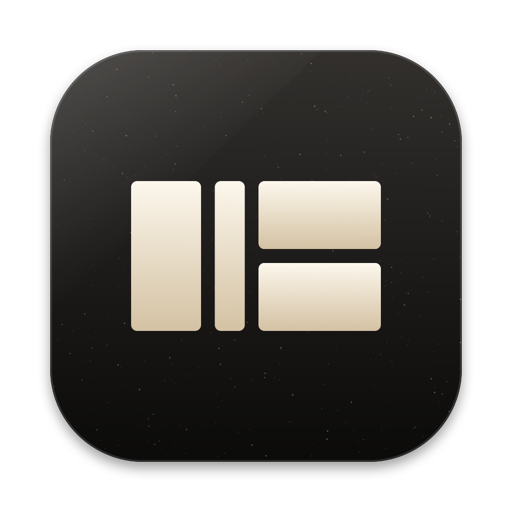
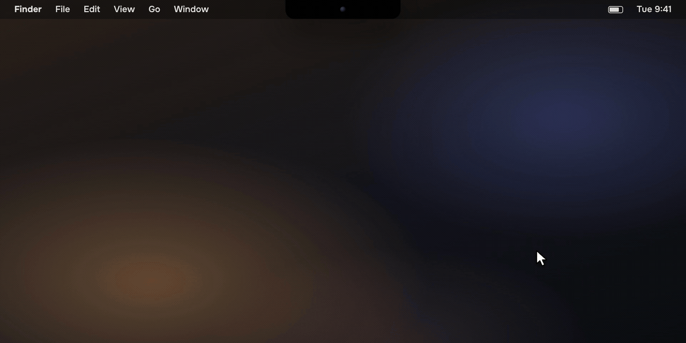
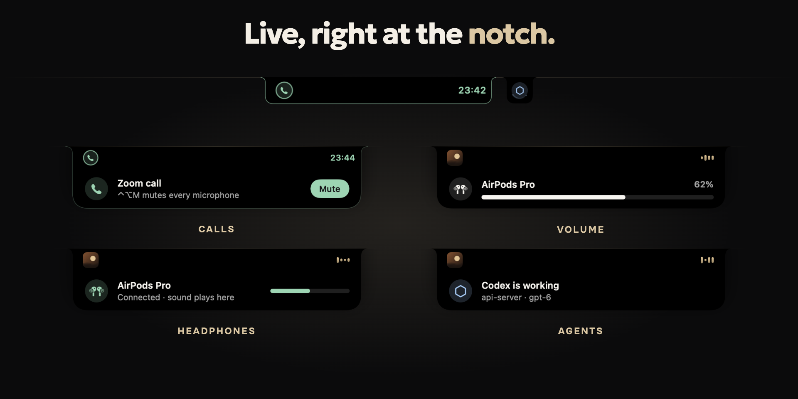
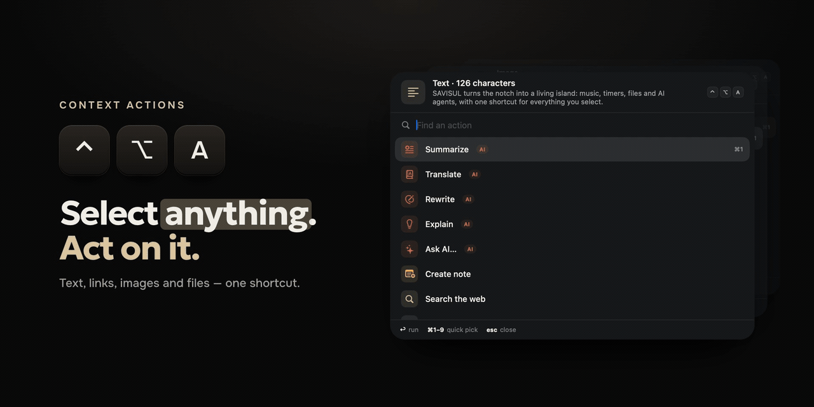
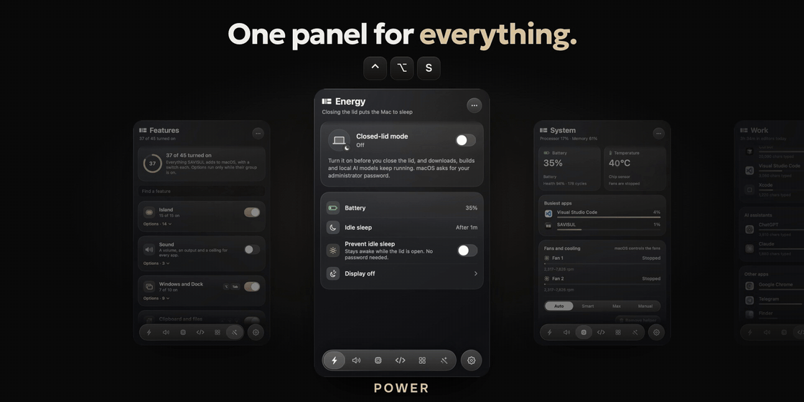
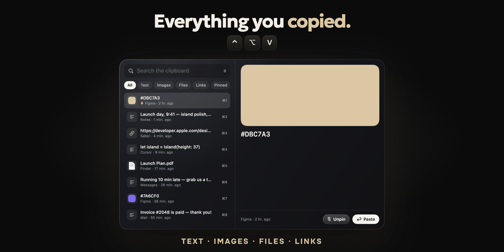
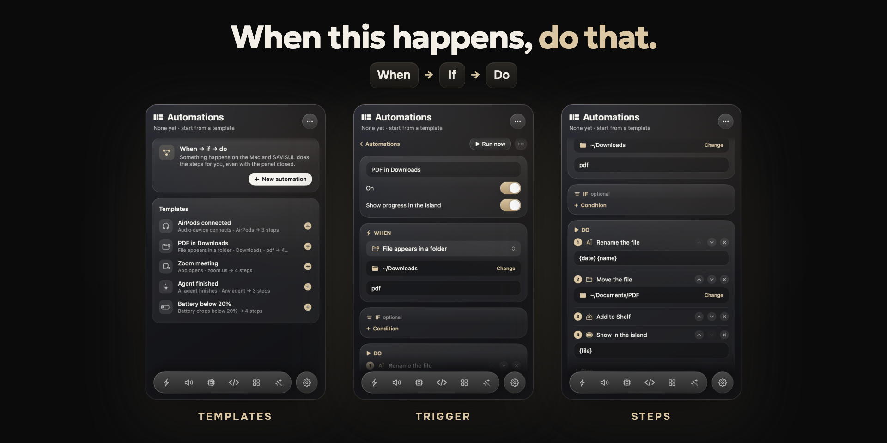
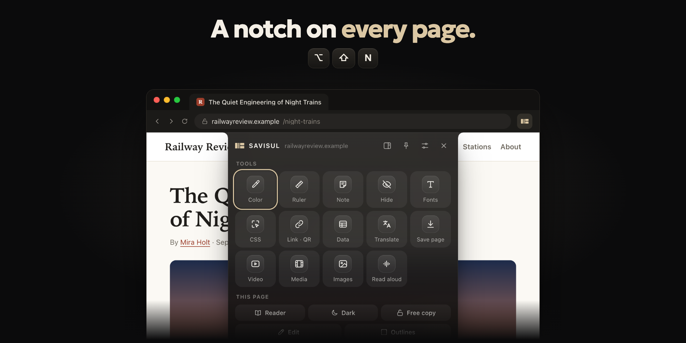

<p align="center">
  
</p>

<h1 align="center">SAVISUL</h1>

<p align="center">
  <strong>Your Mac, browser and AI — one command away.</strong><br>
  A native macOS suite that turns the notch into a living island<br>
  and puts everything else one shortcut from wherever you are.
</p>

<p align="center">
  
  
  
  
</p>

<p align="center">
  <a href="https://github.com/mouldloft/SAVISUL/releases/latest/download/SAVISUL-2.0.dmg"></a>
</p>

<p align="center">
  <sub>Free · 4 MB · macOS 14.2 or later on Apple silicon</sub><br>
  <a href="https://www.savisul.com">Website</a>
  &nbsp;·&nbsp;
  <a href="#keyboard-shortcuts">Shortcuts</a>
  &nbsp;·&nbsp;
  <a href="#privacy">Privacy</a>
  &nbsp;·&nbsp;
  <a href="#faq">FAQ</a>
</p>

<p align="center">
  
</p>

<table>
  <tr>
    <td width="25%" valign="top"><b>Native and light</b><br>Swift, SwiftUI and AppKit. A 4 MB download, no Electron.</td>
    <td width="25%" valign="top"><b>Private by default</b><br>No account, no analytics, no telemetry.</td>
    <td width="25%" valign="top"><b>Your AI, your keys</b><br>Eight providers, any OpenAI-compatible server or a local model.</td>
    <td width="25%" valign="top"><b>Four languages</b><br>English, Russian, Ukrainian and French.</td>
  </tr>
</table>

SAVISUL replaces a pile of small utilities with one system: an island in the notch, actions for whatever you select, a command bar, clipboard history, window snapping, per-app sound, automations and AI on your own keys — sharing one actions engine, built natively for macOS.

## The island

Your MacBook's notch becomes an activity center. Hover it and it opens. While music or a call fills it, an agent at work gets a small island of its own beside it.

- **Music and live lyrics** — what's playing, synced to the line.
- **Calls** — Zoom, Teams, FaceTime, Telegram, WhatsApp, Discord, or a meeting in a browser tab: how long you've been on, and buttons for the microphone, the camera, the sound and hanging up.
- **Your AI agents** — your coding agents at a glance: who is working, on which project, and their tokens, code and limits.
- **Volume and headphones** — the level as you change it, and AirPods or any other output the moment it connects.
- **Live activities** — downloads, timers, conversions, captures and AI tasks as they happen.
- **Files, camera and calendar** — a shelf for drops, a mirror before a call, your next meeting.

<p align="center">
  
</p>

## Context Actions

Select text, a link, an image or files in any app and press <kbd>⌃</kbd> <kbd>⌥</kbd> <kbd>A</kbd>. SAVISUL offers the actions that fit what you picked.

Summarize · Translate · Recognize text · Convert · Compress · Clean link · Ask AI · Save to Shelf

<p align="center">
  
</p>

## One panel for everything

<kbd>⌃</kbd> <kbd>⌥</kbd> <kbd>S</kbd> opens one panel for power, cooling, focus and every feature: closed-lid mode and sleep, fans and temperatures, your time in editors and AI assistants, and a switch for every feature.

<p align="center">
  
</p>

## Clipboard history

<kbd>⌃</kbd> <kbd>⌥</kbd> <kbd>V</kbd> opens everything you copied — text, images, files, links and colors — with search, filters, pins and a preview. <kbd>⌘</kbd> <kbd>1</kbd>–<kbd>9</kbd> pastes an item, and <kbd>⌃</kbd> <kbd>⌥</kbd> <kbd>⇧</kbd> <kbd>V</kbd> pastes plain text. Up to 1,000 items, kept on your Mac.

<p align="center">
  
</p>

## Automations

Build workflows with one simple model: **WHEN → IF → DO**.

> **When** a PDF lands in Downloads → **do** rename it to `{date} {name}`, move it to `~/Documents/PDF`, add it to the Shelf and show it on the island.

| Step | Choose from |
|---|---|
| **When** | an app launches or quits · a device connects · a file appears · an AI agent finishes · the battery drops · power connects · on a schedule |
| **If** | battery level · on power or battery · an app is running · a time window · weekdays · the audio output |
| **Do** | notices and sounds · volume and output · mute mics · open or quit apps · URLs · shortcuts · SAVISUL actions · rename and move files · Shelf |

<p align="center">
  
</p>

## In your browser

The extension puts the same notch at the top of every web page. Hover the top edge or press <kbd>⌥</kbd> <kbd>⇧</kbd> <kbd>N</kbd> for a reader, dark theme, color picker, ruler, notes, fonts, CSS inspector, link cleaner and QR codes, hidden elements, full-page screenshots, video speed, tables to CSV or Markdown, translation, read aloud, and export to Markdown, PDF or a web archive. A side panel keeps your tabs, sessions, bookmarks, notes and AI.

It talks to the Mac app, so a page, an image or a selection goes straight into actions, the Shelf or AI. It works in Chrome, Edge, Brave, Arc, Opera, Vivaldi and Yandex Browser.

<p align="center">
  
</p>

## Everyday tools

| Tool | Shortcut | What it does |
|---|---|---|
| **Command Bar** | <kbd>⌥</kbd> <kbd>Space</kbd> | Apps, windows, the front app's menu commands, SAVISUL actions, clipboard, files, and quick math and conversions |
| **Window snapping** | <kbd>⌃</kbd> <kbd>⌥</kbd> <kbd>←</kbd> | Halves, quarters, thirds and maximize — from the keyboard or by dragging to an edge |
| **Per-app sound** | | Each app its own level, up to 200 %, and its own output |
| **Window switcher** | <kbd>⌥</kbd> <kbd>Tab</kbd> | Every window with a live picture |

## Keyboard shortcuts

| Shortcut | What it does |
|---|---|
| <kbd>⌃</kbd> <kbd>⌥</kbd> <kbd>S</kbd> | Open the SAVISUL panel |
| <kbd>⌃</kbd> <kbd>⌥</kbd> <kbd>A</kbd> | Context Actions for what you selected |
| <kbd>⌥</kbd> <kbd>Space</kbd> | Command Bar |
| <kbd>⌃</kbd> <kbd>⌥</kbd> <kbd>V</kbd> | Clipboard history |
| <kbd>⌃</kbd> <kbd>⌥</kbd> <kbd>⇧</kbd> <kbd>V</kbd> | Paste as plain text |
| <kbd>⌃</kbd> <kbd>⌥</kbd> <kbd>P</kbd> | Quick panel of favorite actions |
| Hold <kbd>⌃</kbd> <kbd>⌥</kbd> <kbd>R</kbd> | Radial menu — flick toward an action and release |
| <kbd>⌥</kbd> <kbd>Tab</kbd> | Switch windows with live previews |
| <kbd>⌃</kbd> <kbd>⌥</kbd> <kbd>←</kbd> <kbd>→</kbd> <kbd>↑</kbd> <kbd>↓</kbd> | Snap the front window to a half |
| <kbd>⌃</kbd> <kbd>⌥</kbd> <kbd>↩</kbd> &nbsp;/&nbsp; <kbd>⌃</kbd> <kbd>⌥</kbd> <kbd>⌫</kbd> | Maximize / restore |
| <kbd>⌃</kbd> <kbd>⌥</kbd> <kbd>O</kbd> | Switch to the next audio output |
| <kbd>⌃</kbd> <kbd>⌥</kbd> <kbd>M</kbd> | Mute or unmute all microphones |
| <kbd>⌥</kbd> <kbd>⇧</kbd> <kbd>N</kbd> | Open the notch on a web page |

## Everything inside

<details>
<summary><b>Productivity</b></summary>

- Command Bar
- Clipboard History
- Universal Shelf
- Context Actions
- Custom Hotkeys
- Quick Actions
- Notes
- Timers

</details>

<details>
<summary><b>macOS</b></summary>

- Window Management
- Audio Mixer
- App Switching
- Dock Preview
- System Monitor
- Keep Awake
- Screen Capture
- Power Tools

</details>

<details>
<summary><b>Browser</b></summary>

- Reader Mode
- Dark Mode
- Full-page Screenshot
- Color Picker
- Ruler
- Notes
- Font Inspector
- Link Cleaner
- QR Generator
- Media Speed Controls
- Table/Data Extraction

</details>

## Why SAVISUL?

Most Mac utilities solve one problem. SAVISUL connects them.

Instead of separate apps for clipboard history, window management, AI, screenshots, browser tools, system monitoring and automations, SAVISUL gives them one shared action system. The same action runs from the Command Bar, Context Actions, the Shelf, the browser, Automations and the island.

<details>
<summary><b>How it works</b></summary>

SAVISUL is built around a unified Actions Engine. Every action describes its inputs, permissions, parameters, execution, output, progress and Live Activity state, so the same functionality can be triggered from any part of the product.

```text
 Command Bar · Context Actions · Shelf · Browser · Automations · Island
                                  │
                                  ▼
                       SAVISUL Actions Engine
                                  │
                                  ▼
                macOS · AI · Files · Browser · System
```

</details>

## Installation

### Download

SAVISUL runs on macOS 14.2 or later on a Mac with Apple silicon.

1. Download [SAVISUL-2.0.dmg](https://github.com/mouldloft/SAVISUL/releases/latest/download/SAVISUL-2.0.dmg) from [Releases](https://github.com/mouldloft/SAVISUL/releases/latest) or the [website](https://www.savisul.com)
2. Drag SAVISUL into Applications
3. Open SAVISUL
4. Grant only the permissions required by the features you use

SAVISUL is in beta. The build is signed locally and not notarized by Apple, so on first launch macOS may say the file was not opened. Open **System Settings → Privacy & Security → Open Anyway**.

If that button is missing, open the disk image and double-click **Установить SAVISUL.command**. It copies SAVISUL to Applications, clears the quarantine flag and opens it. To do the same from Terminal, follow [If it won't open.txt](site/download/If%20it%20won't%20open.txt).

### Build from source

You need the Command Line Tools for Xcode 16.2 (Swift 6.0.3), the toolchain CI builds with.

```sh
./build.sh                # builds dist/SAVISUL.app and installs it
./build.sh --no-install   # builds only
zsh ./scripts/test.sh     # unit tests
```

The browser extension lives in `Extension/`. SAVISUL copies it out of the app: in the browser, turn on Developer mode, choose Load unpacked, and pick that folder.

| Path | What lives there |
|---|---|
| `Sources/SAVISUL` | The Mac app: Swift, SwiftUI and AppKit |
| `Sources/MediaBridge`, `Sources/FanHelper`, `Sources/SMCBridge` | The Now Playing bridge, the fan helper and the sensor reader |
| `Extension` | The browser extension |
| `site` | The website |
| `Tests` | Unit tests |
| `scripts` | Build, test and packaging scripts |

## Permissions

SAVISUL only requests a permission when a feature needs it. You can turn any of them off in System Settings.

| Permission | Why it is needed |
|---|---|
| Accessibility and Input Monitoring | Window management, menus, Dock previews, shortcuts and the typing counter |
| Screen Recording | Live window previews, screenshots and capture |
| Audio capture | Per-app volume and the island equalizer |
| Notifications | Alerts you turned on |
| Calendar | The next meeting on the island |
| Camera | The island camera mirror. Video is shown live and is not saved |
| Downloads, Desktop and Documents | Downloads, Shelf, captures and disk-image installs |
| Automation | Asking Finder and macOS to do something you started |

Closed-lid mode changes a system sleep setting, so macOS shows its own administrator password dialog. SAVISUL never sees that password.

## Privacy

SAVISUL is designed local-first.

- Clipboard data stays on your Mac
- Local actions run locally
- API keys are stored in the macOS Keychain
- AI requests are only sent to the provider you configure
- Local AI providers such as Ollama can run without cloud processing
- Calls are noticed from which app is using the microphone; the sound itself is never read
- No analytics, no telemetry and no ads

Lyrics lookup sends a track’s title, artist, album and length to lrclib.net. Currency conversion downloads the day’s rates. Those are the app’s own network calls, and only when you use the feature. Details are in [PRIVACY.md](PRIVACY.md) and on the [website](https://www.savisul.com/privacy).

## AI providers

On the Mac, use your own provider:

Anthropic · OpenAI · Gemini · OpenRouter · Groq · DeepSeek · Mistral · Ollama

Bring your own API key, point SAVISUL at any OpenAI-compatible server, or use a local model.

The browser side panel uses the key saved in the extension. The Mac app accepts any provider you set.

## FAQ

<details>
<summary><b>Is SAVISUL free?</b></summary>

Yes. It is free and open source under the Apache License 2.0. The name and logo stay with the project; see [TRADEMARKS.md](TRADEMARKS.md).

</details>

<details>
<summary><b>Do I need a MacBook with a notch?</b></summary>

No. On a Mac without one, the island waits at the top center of the main screen and opens when you move the pointer to the top edge.

</details>

<details>
<summary><b>Does it run on Intel Macs?</b></summary>

No. SAVISUL is built for Apple silicon and needs macOS 14.2 or later.

</details>

<details>
<summary><b>How does the island know I'm on a call?</b></summary>

It asks macOS which apps are using the microphone right now, the same fact behind the orange dot in the menu bar. Nothing is recorded or listened to.

</details>

<details>
<summary><b>Why does macOS say the app can't be opened?</b></summary>

The build is signed locally and not notarized by Apple. [Installation](#installation) shows the two ways past it.

</details>

<details>
<summary><b>Can I turn parts of it off?</b></summary>

Yes. Every feature has a switch in the panel's Features tab, and SAVISUL asks for a permission only when a feature that needs it is on.

</details>

<details>
<summary><b>Is the browser extension on the Chrome Web Store?</b></summary>

No. It ships inside the app: SAVISUL shows you the folder, and you load it unpacked once.

</details>

## Roadmap

| Shipped | Next |
|---|---|
| ✅ Actions Engine | Capture Studio |
| ✅ Context Actions | Profiles |
| ✅ Automations | Plugin SDK |
| ✅ Multi-provider AI | Marketplace |
| ✅ Browser integration | Sync |
| ✅ Live Activities | SAVISUL Account |

## Contributing

SAVISUL is primarily maintained by its creator, but contributions are welcome.

Good first contributions: bug fixes, documentation, translations, tests and small isolated features.

Bugs and ideas go to [Issues](https://github.com/mouldloft/SAVISUL/issues). Fixes come in as pull requests from a fork, and each one is reviewed before it is merged. Please open an issue before working on major architectural changes. See [CONTRIBUTING.md](CONTRIBUTING.md).

## Security

If you discover a security issue, please do not open a public issue. Report it privately to [mouldloft@gmail.com](mailto:mouldloft@gmail.com). See [SECURITY.md](SECURITY.md).

## License

SAVISUL source code is licensed under the Apache License 2.0 unless stated otherwise.

The SAVISUL name, logo, visual identity and branding are not granted under the source-code license. See [LICENSE](LICENSE), [NOTICE](NOTICE) and [TRADEMARKS.md](TRADEMARKS.md).

<p align="center">
  <sub>© 2026 The SAVISUL Authors</sub>
</p>
